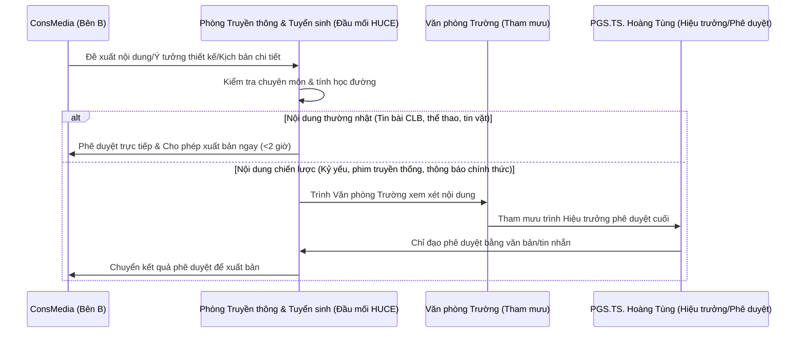

# BẢN ĐỀ XUẤT HÀNH ĐỘNG THEO CƠ CHẾ ĐỐI TÁC TRUYỀN THÔNG (MEDIA PARTNERSHIP ACTION PROPOSAL)
**Dự án: Chiến dịch Kỷ niệm 70 năm đào tạo, 60 năm thành lập Trường (HUCE H60)**  

---

## 1. BA TRỤ CỘT HÀNH ĐỘNG TRỌNG TÂM

Để giải quyết triệt để các vấn đề cấp bách của HUCE, ConsMedia đề xuất lộ trình hành động tập trung vào 3 trụ cột cốt lõi dưới đây:

```
┌────────────────────────────────────────────────────────────────────────────────────────┐
│                              BA TRỤ CỘT HÀNH ĐỘNG HUCE H60                             │
├────────────────────┬────────────────────────────────────┬──────────────────────────────┤
│     TRỤ CỘT 1      │             TRỤ CỘT 2              │          TRỤ CỘT 3           │
│ Chuẩn hóa Nhận diện│  Quy trình điều phối & Vận hành   │    Dịch vụ truyền thông      │
│   & Bảo hộ SHTT    │        kênh truyền thông           │   sự kiện gia tăng (H60)     │
└────────────────────┴────────────────────────────────────┴──────────────────────────────┘
```

### Trụ cột 1: Chuẩn hóa Nhận diện thương hiệu & Đăng ký bảo hộ sở hữu trí tuệ
*   **Mục tiêu:** Xây dựng hệ thống hình ảnh đồng bộ chuyên nghiệp và thiết lập "lá chắn pháp lý" bảo vệ tài sản trí tuệ của nhà trường.
*   **Hành động chủ chốt:**
    1.  Khảo sát và Tinh chỉnh hình lưới hình học logo HUCE mới, khóa mã màu chuẩn HSL Cobalt Blue.
    2.  Hệ thống hóa tài liệu Guidelines bao gồm hệ lưới đồ họa, typography và các ứng dụng văn phòng, thiết kế quà tặng.
    3.  **Thiết kế lại toàn bộ giao diện hệ thống website của trường** (gồm trang chủ Portal, trang tuyển sinh, và các template dùng chung cho Khoa/Viện).
    4.  **Thực hiện trọn gói thủ tục đăng ký bảo hộ nhãn hiệu độc quyền** đối với tên viết tắt "HUCE" và logo mới tại Cục Sở hữu trí tuệ (Nhóm 41, 16, 25, 35).

### Trụ cột 2: Quy trình quản lý truyền thông & Dịch vụ vận hành website đồng hành
*   **Mục tiêu:** Thiết lập quy trình làm việc chuẩn hóa, tăng tốc độ xuất bản thông tin và đảm bảo hệ thống website hoạt động sinh động, an toàn.
*   **Hành động chủ chốt:**
    1.  Biên soạn bộ quy trình tác nghiệp truyền thông (SOPs) chuẩn từ khâu viết bài, thiết kế banner đến phê duyệt đa cấp di động.
    2.  Xây dựng lịch biên tập (Editorial Calendar) tổng thể định hướng nội dung đa kênh.
    3.  Cung cấp dịch vụ **chăm sóc và vận hành website đồng hành 12 tháng năm 2026** (Kỹ thuật bảo trì máy chủ, biên tập tin bài chuẩn SEO, thiết kế banner vận hành thường nhật).

### Trụ cột 3: Các dịch vụ truyền thông sự kiện gia tăng (On-demand Services)
*   **Mục tiêu:** Đáp ứng nhu cầu truyền thông sự kiện thực tế trong chuỗi đại lễ H60 và các hội thảo khoa học lớn của trường.
*   **Hành động chủ chốt:**
    1.  Cung cấp dịch vụ quay phim Highlight 4K, chụp ảnh sự kiện lấy nhanh phục vụ đăng bài mạng xã hội tức thời.
    2.  Cung cấp dịch vụ livestream đa góc máy chất lượng cao phát trực tiếp lên Fanpage & YouTube trường.
    3.  Cung cấp nhân sự chuyên nghiệp phục vụ sự kiện: Tổng đạo diễn, dẫn chương trình (MC), đội ngũ lễ tân mặc áo dài nhận diện Cobalt Blue.

---

## 2. QUY TRÌNH PHỐI HỢP TÁC NGHIỆP & PHÊ DUYỆT

Để đảm bảo tính chuẩn xác của thông tin hành chính, quy trình phối hợp duyệt nội dung giữa ConsMedia và HUCE được thiết lập như sau:



---

## 3. CƠ CHẾ PHÒNG NGỪA & XỬ LÝ KHỦNG HOẢNG TRUYỀN THÔNG

*   **Tổ phản ứng nhanh:** Thành lập nhóm chat điều phối khẩn cấp gồm Trưởng phòng Truyền thông & Tuyển sinh HUCE và Giám đốc điều hành dự án ConsMedia.
*   **Quét thông tin tự động:** Sử dụng các công cụ lắng nghe mạng xã hội (Social Listening) để phát hiện sớm các bài đăng, bình luận tiêu cực liên quan đến HUCE trên các hội nhóm sinh viên tự phát.
*   **Nguyên tắc xử lý sự cố:**
    1.  *Trong vòng 15 phút:* Phát hiện và báo cáo mức độ ảnh hưởng của tin tiêu cực lên nhóm điều phối.
    2.  *Trong vòng 30 phút:* Lập phương án xử lý kỹ thuật (yêu cầu ẩn bình luận tiêu cực, khóa bài viết giả mạo hoặc soạn thảo thông cáo đính chính).
    3.  *Phát ngôn chính thức:* Chỉ có Hiệu trưởng hoặc người được ủy quyền bằng văn bản mới đại diện HUCE phát ngôn trước báo chí.

---

## 4. KẾT LUẬN & HÀNH ĐỘNG NGAY (IMMEDIATE ACTIONS)

Để đảm bảo tiến độ triển khai kịp thời trước thềm các sự kiện lớn, hai bên thống nhất:
1.  **Triển khai trước các đầu việc thiết kế qua MOU:** Ký kết Biên bản ghi nhớ để ConsMedia bắt tay ngay vào việc tinh chỉnh logo, làm đăng ký bảo hộ sở hữu trí tuệ sớm nhằm tránh rủi ro mất quyền đăng ký nhãn hiệu.
2.  **Nghiệm thu thanh toán theo giai đoạn:** Thực hiện ký kết hợp đồng và nghiệm thu cuốn chiếu theo từng gói sản phẩm cố định độc lập (Gói 1 hoàn thành nghiệm thu bàn giao file gốc, Gói 2 nghiệm thu dịch vụ vận hành hàng tháng).
