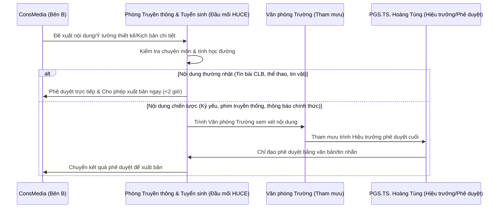

# PHẦN 2: QUY TRÌNH TÁC NGHIỆP & MA TRẬN PHÂN ĐỊNH TRÁCH NHIỆM RACI
**Dự án: Chuẩn hóa Thương hiệu & Tái cấu trúc Hệ thống Vận hành Truyền thông**

---

## 1. QUY TRÌNH PHỐI HỢP TÁC NGHIỆP & PHÊ DUYỆT

Để đảm bảo tính chuẩn xác của thông tin hành chính, quy trình phối hợp duyệt nội dung giữa ConsMedia và HUCE được thiết lập như sau:

---

