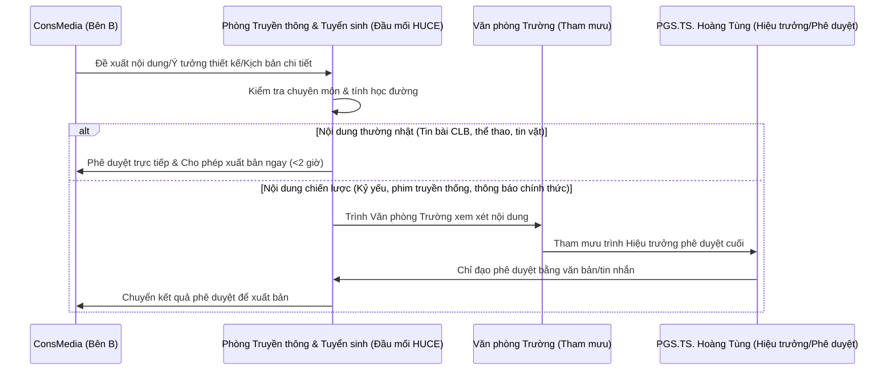

# BÁO CÁO 02: ĐỀ XUẤT HÀNH ĐỘNG THEO CƠ CHẾ ĐỐI TÁC TRUYỀN THÔNG
**Dự án: Chuẩn hóa Thương hiệu & Tái cấu trúc Hệ thống Vận hành Truyền thông**  

---

## 1. BA TRỤ CỘT HÀNH ĐỘNG TRỌNG TÂM

Để giải quyết triệt để các vấn đề của HUCE, ConsMedia đề xuất lộ trình hành động tập trung vào 3 trụ cột cốt lõi dưới đây:

```
┌────────────────────────────────────────────────────────────────────────────────────────┐
│                             BA TRỤ CỘT HÀNH ĐỘNG THƯƠNG HIỆU HUCE                      │
├────────────────────┬────────────────────────────────────┬──────────────────────────────┤
│     TRỤ CỘT 1      │             TRỤ CỘT 2              │          TRỤ CỘT 3           │
│ Chuẩn hóa Nhận diện│  Quy trình điều phối & Vận hành   │    Dịch vụ truyền thông      │
│   & Bảo hộ SHTT    │        kênh truyền thông           │   sự kiện gia tăng (On-demand)│
└────────────────────┴────────────────────────────────────┴──────────────────────────────┘
```

### Trụ cột 1: Chuẩn hóa Nhận diện thương hiệu & Đăng ký bảo hộ sở hữu trí tuệ
*   **Mục tiêu:** Xây dựng hệ thống hình ảnh đồng bộ chuyên nghiệp và thiết lập "lá chắn pháp lý" bảo vệ tài sản trí tuệ của nhà trường.
*   **Hành động chủ chốt:**
    1.  Khảo sát và Tinh chỉnh hình lưới hình học logo HUCE mới, khóa mã màu chuẩn HSL Cobalt Blue.
    2.  Hệ thống hóa tài liệu Guidelines bao gồm hệ lưới đồ họa, typography và các ứng dụng văn phòng, thiết kế quà tặng.
    3.  **Thiết kế lại toàn bộ giao diện hệ thống website của trường** (gồm trang chủ Portal, trang tuyển sinh, và các template dùng chung cho Khoa/Viện).
    4.  **Thực hiện trọn gói thủ tục đăng ký bảo hộ nhãn hiệu độc quyền** đối với tên viết tắt "HUCE" và logo mới tại Cục Sở hữu trí tuệ (Nhóm 41, 16, 25, 35).

### Trụ cột 2: Quy trình quản lý truyền thông & Dịch vụ vận hành website đồng hành
*   **Mục tiêu:** Thiết lập quy trình làm việc chuẩn hóa, tăng tốc độ xuất bản thông tin và đảm bảo hệ thống website hoạt động sinh động, an toàn.
*   **Hành động chủ chốt:**
    1.  Biên soạn bộ quy trình tác nghiệp truyền thông (SOPs) chuẩn từ khâu viết bài, thiết kế banner đến phê duyệt đa cấp di động.
    2.  Lập khung lịch biên tập (Editorial Calendar) tổng thể định hướng nội dung đa kênh.
    3.  Cung cấp dịch vụ **chăm sóc và vận hành website đồng hành 12 tháng** (Kỹ thuật bảo trì máy chủ, biên tập tin bài chuẩn SEO, thiết kế banner vận hành thường nhật).

### Trụ cột 3: Các dịch vụ truyền thông sự kiện gia tăng (On-demand Services)
*   **Mục tiêu:** Đáp ứng nhu cầu truyền thông các sự kiện học thuật, đối ngoại và ngày lễ lớn của trường.
*   **Hành động chủ chốt:**
    1.  Cung cấp dịch vụ quay phim Highlight 4K, chụp ảnh sự kiện lấy nhanh phục vụ đăng bài mạng xã hội tức thời.
    2.  Cung cấp dịch vụ livestream đa góc máy chất lượng cao phát trực tiếp lên Fanpage & YouTube trường.
    3.  Cung cấp nhân sự chuyên nghiệp phục vụ sự kiện: Tổng đạo diễn, dẫn chương trình (MC), đội ngũ lễ tân mặc áo dài nhận diện Cobalt Blue.

---

## 2. LỘ TRÌNH TRIỂN KHAI DỰ ÁN TỔNG THỂ (6 GIAI ĐOẠN)

Lộ trình triển khai được thiết kế tối ưu xoay quanh cột mốc quan trọng là Đại lễ H60 ngày 14/11/2026, với mốc thời gian thực được xác lập cụ thể như sau:

*   **Giai đoạn 1: Khảo sát & Đánh giá Thực trạng truyền thông HUCE (20/05/2026 - 19/06/2026):**
    *   *Nội dung:* Tiếp cận, khảo sát thực tế di sản hình ảnh tại 13+ đơn vị khoa/phòng ban HUCE, đo lường độ phân mảnh màu sắc và đánh giá rủi ro pháp lý sở hữu trí tuệ của nhãn hiệu (giai đoạn khảo sát trước mốc thời gian thực 20/06/2026).
*   **Giai đoạn 2: Chuẩn hóa Nhận diện & Nộp hồ sơ bảo hộ SHTT (20/06/2026 - 15/07/2026):**
    *   *Nội dung:* Tinh chỉnh lưới hình học logo gốc, thiết kế bộ cẩm nang thương hiệu (Brand Guidelines), in ấn 15 cuốn cao cấp lưu hành nội bộ, soạn thảo hồ sơ nộp đơn đăng ký bảo hộ độc quyền nhãn hiệu tại Cục Sở hữu Trí tuệ.
*   **Giai đoạn 3: Thiết kế Hệ thống Ấn phẩm & UI/UX Kênh số (16/07/2026 - 15/08/2026):**
    *   *Nội dung:* Thiết kế chi tiết 10 hạng mục ấn phẩm văn phòng (Office Stationery), bộ tài sản số (Digital Assets), giao diện hệ thống website Portal/Admissions (Web UI/UX Redesign Figma Kit) và thiết lập quy chuẩn hệ thống bảng biển chỉ dẫn toàn trường.
*   **Giai đoạn 4: Quy trình Quản lý SOPs & Đóng gói Quà tặng VIP (Phục vụ trước Đại lễ) (16/08/2026 - 15/09/2026):**
    *   *Nội dung:* Xây dựng quy trình tác nghiệp truyền thông chuẩn (SOPs), kịch bản ứng phó sự cố truyền thông, thiết kế khung tiêu chuẩn quà tặng thương hiệu phân cấp (Lãnh đạo, khách hàng, sinh viên...) để chuẩn bị sản xuất trước thềm Đại lễ H60.
*   **Giai đoạn 5: Đồng hành Vận hành & Duy trì Kênh số (Hỗ trợ Đại lễ & Hậu H60) (16/09/2026 - 15/11/2026):**
    *   *Nội dung:* Triển khai và lập trình cổng thông tin Brand Portal trực tuyến để quản trị tài nguyên số. Đồng hành cùng nhà trường vận hành kỹ thuật, bảo trì bảo mật máy chủ website, cập nhật nội dung tin tức chuẩn SEO và thiết kế banner vận hành phục vụ trực tiếp cho chiến dịch Đại lễ H60 (ngày 14/11/2026).
*   **Giai đoạn 6: Bảo trì, Gia hạn & Đồng hành Pháp lý (Dài Hạn) (16/11/2026 - 15/06/2027):**
    *   *Nội dung:* Tiếp tục đồng hành chăm sóc kỹ thuật website Portal trong thời hạn 12 tháng, theo dõi tiến trình thẩm định đơn đăng ký bảo hộ độc quyền nhãn hiệu tại Cục Sở hữu Trí tuệ và chuyển giao năng lực tự vận hành cho Ban truyền thông trường.

---

## 3. QUY TRÌNH PHỐI HỢP TÁC NGHIỆP & PHÊ DUYỆT

Để đảm bảo tính chuẩn xác của thông tin hành chính, quy trình phối hợp duyệt nội dung giữa ConsMedia và HUCE được thiết lập như sau:



---

## 4. BẢN PHÂN TÍCH HIỆU QUẢ ĐẦU TƯ VÀ GIÁ TRỊ THU LẠI DỰ KIẾN (ROI & SYSTEM EFFICIENCY)

Đầu tư vào Nhận diện thương hiệu và Quy trình Vận hành Website không chỉ đơn thuần là chi phí truyền thông ngắn hạn, mà là một khoản **đầu tư chiến lược dài hạn** mang lại các giá trị thặng dư đo lường được cụ thể cho trường HUCE:

### 4.1. Nâng Tầm Giá Trị Thương Hiệu (Brand Equity Value-Add)
*   **Giải quyết khoảng cách nhận diện:** Khắc phục triệt để sự đứt gãy nhận diện công chúng giữa Trường Đại học Xây dựng Hà Nội (cũ) và HUCE (mới), định vị trường đa ngành hiện đại, mở rộng uy tín học thuật trong nước và quốc tế.
*   **Tăng trưởng chỉ số tương tác số:** Dự kiến tăng trưởng **45% - 60%** lượt tiếp cận (reach) và tương tác (engagement) trên toàn bộ hệ thống kênh số trong suốt giai đoạn tiếp cận và vận hành.

### 4.2. Hiệu Quả Vận Hành Hệ Thống (System Efficiency)
Áp dụng hệ thống quy trình số tự động giúp tối ưu hóa tối đa thời gian và công sức cán bộ:
*   **Chu kỳ Phê duyệt Bài đăng & Media:** 
    *   *Phương thức thủ công cũ:* Mất 02 - 03 ngày gửi email đính kèm tệp nặng hoặc trình ký giấy xin duyệt nội dung.
    *   *Quy trình mới:* Tự động hóa qua luồng phê duyệt Content & Media di động. Rút ngắn thời gian duyệt xuống **dưới 2 giờ**, kịp thời phát sóng và ngừa 100% rủi ro khủng hoảng thông tin.
*   **Thời gian Tác nghiệp BTV & Thiết kế:**
    *   *Phương thức thủ công cũ:* Tốn 40 giờ/tháng đóng watermark ảnh thủ công, upload gửi báo chí, hoặc hỗ trợ thủ công.
    *   *Quy trình mới:* Tự động đóng watermark bản quyền, tự sinh link chia sẻ tài nguyên RAW tốc độ cao qua Shared Media Cloud. Tiết kiệm **120 - 150 giờ/tháng**, giải phóng nhân lực tập trung vào sáng tạo nội dung.
*   **Thời gian Điều phối Phối hợp nội bộ:**
    *   *Phương thức thủ công cũ:* Tiêu tốn 60 giờ họp hành/tháng của Ban tổ chức để theo dõi 13+ đơn vị qua các nhóm chat Zalo/Viber chồng chéo.
    *   *Quy trình mới:* Đồng bộ tập trung trên Web Portal Kanban Task Management và Cổng thông tin Brand Portal. Giảm **80% thời gian họp điều phối**, kiểm soát tiến độ trực quan.
*   **Quản lý vinh danh đóng góp Quỹ cựu sinh viên:**
    *   *Phương thức thủ công cũ:* Cán bộ nhập tay danh sách ủng hộ, đối chiếu sao kê thủ công, mất 1 - 2 tuần để cập nhật vinh danh.
    *   *Quy trình mới:* Tích hợp cổng VietQR đóng góp tự động, tự đối chiếu hiển thị danh sách vinh danh tức thời trên Cổng Brand Portal. Đạt tự động hóa **100%**, minh bạch dòng tiền ủng hộ Quỹ.

### 4.3. Hiệu Quả Tài Chính và Tối Ưu Hóa Ngân Sách
*   **Tối ưu chi phí khánh tiết trực tiếp:** Tiết kiệm từ **35.000.000 VND - 50.000.000 VND** nhờ áp dụng hệ thống thư mời điện tử e-invite QR code cá nhân hóa gửi khách thay thế cho in ấn thiệp giấy cứng đắt đỏ.
*   **Cơ chế đối lưu tài trợ linh hoạt:** Quy chuẩn spec hiển thị thương hiệu của nhà tài trợ trên Cổng thông tin, giúp nhà trường dễ dàng vận động cựu sinh viên doanh nghiệp trực tiếp tài trợ từng sự kiện lẻ đối lưu truyền thông, giảm thiểu tối đa áp lực chi ngân sách công của nhà trường.

---

## 5. KẾT LUẬN & HÀNH ĐỘNG NGAY (IMMEDIATE ACTIONS)

Để đảm bảo tiến độ triển khai kịp thời, hai bên thống nhất:
1.  **Triển khai trước các đầu việc thiết kế qua MOU:** Ký kết Biên bản ghi nhớ để ConsMedia bắt tay ngay vào việc tinh chỉnh logo, làm đăng ký bảo hộ sở hữu trí tuệ sớm nhằm tránh rủi ro mất quyền đăng ký nhãn hiệu.
2.  **Nghiệm thu thanh toán theo giai đoạn:** Thực hiện ký kết hợp đồng và nghiệm thu cuốn chiếu theo từng cấu phần của Gói Tổng Thể (Cấu phần A hoàn thành nghiệm thu bàn giao file thiết kế gốc & nộp đơn bảo hộ SHTT, Cấu phần B nghiệm thu dịch vụ vận hành hàng tháng).

